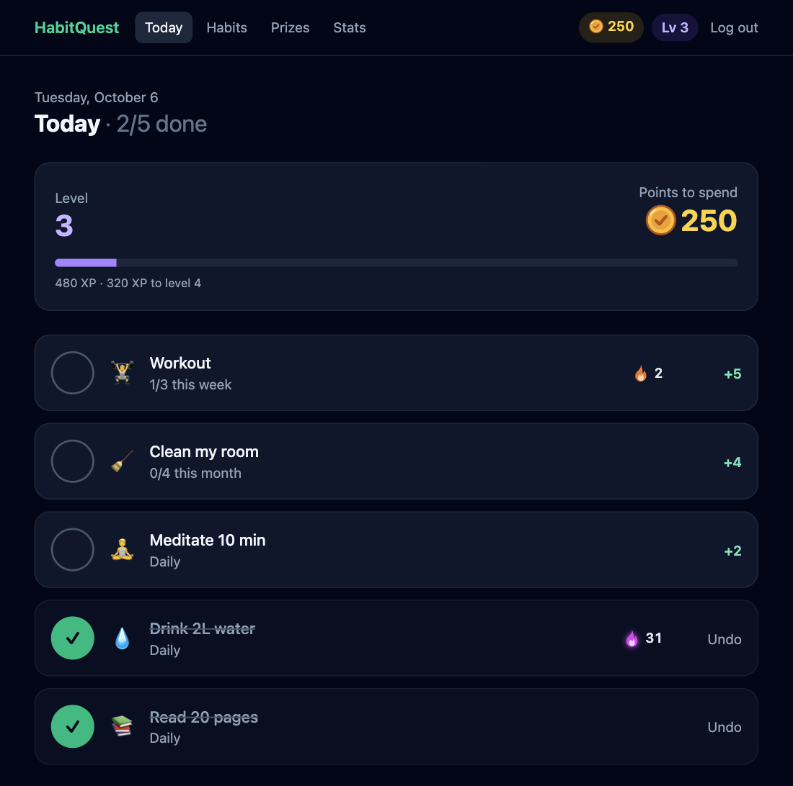
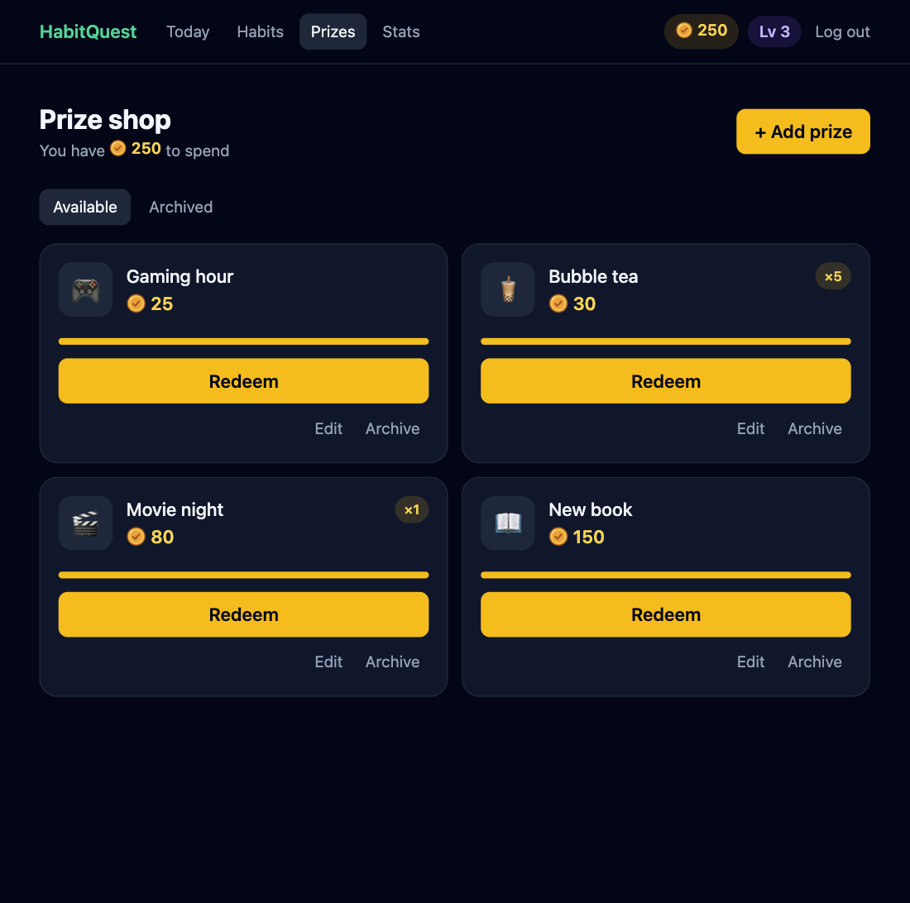
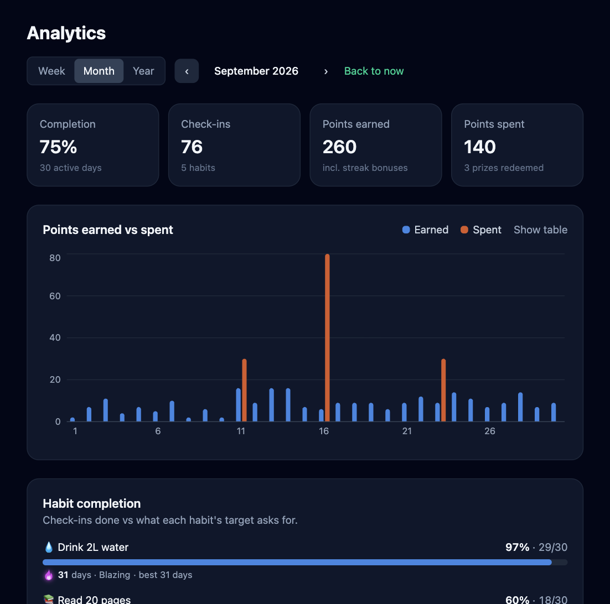
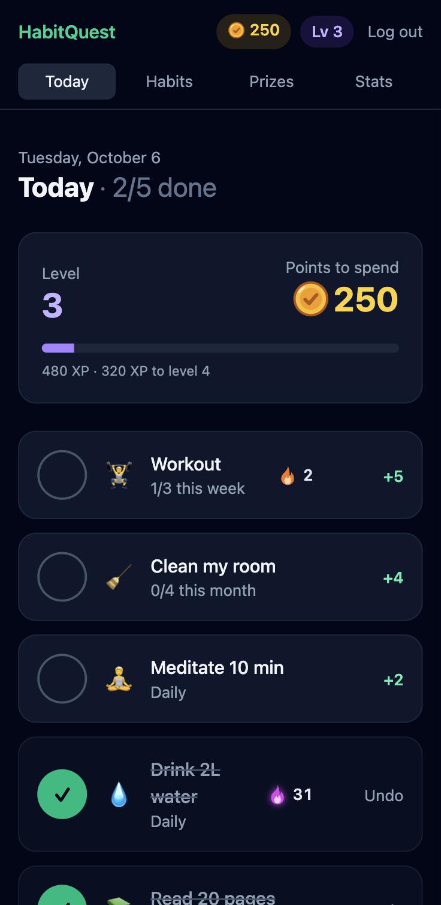
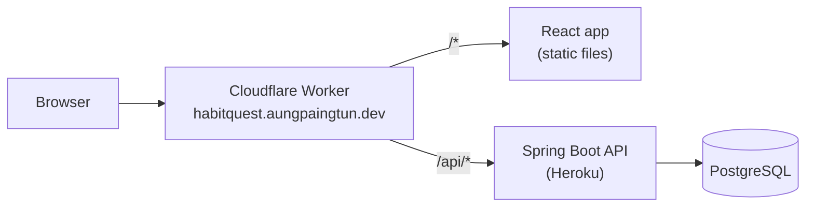

# HabitQuest

Build good habits, earn points, and spend them on rewards you set yourself.

**Live demo: https://habitquest.aungpaingtun.dev**
Log in with `demo@aungpaingtun.dev` / `habitquest-demo` to see an account with two months of history, or register your own.
The API runs on a Heroku dyno that sleeps when idle, so the first request after a quiet spell can take 10 to 15 seconds.


| Today | Prize shop | Stats |
|---|---|---|
|  |  |  |



## What it does

> **Do a habit → earn points → spend points on a reward you chose yourself.**

- **Habits:** daily, or *N* times a week or month, each worth the points you choose. Check in once a day, today only.
- **Streaks:** consecutive days (or weeks or months) earn a flat bonus: +2 from 7 days, +4 from 30. A flame next to each habit heats up as the streak grows.
- **Points and levels:** spendable balance plus lifetime XP. Spending never lowers your level. Level *n* needs 50 × n² XP.
- **Prize shop:** create rewards with a fixed cost and redeem them as often as you can afford. Each prize shows how many times you've redeemed it.
- **Stats:** weekly, monthly and yearly charts, per-habit completion, and a year heatmap.

The full rules, and the reasons behind them, are in the [product requirements](docs/PRD.md).

## Tech stack

| | |
|---|---|
| **Backend** | Java 21 · Spring Boot 4 · Spring Security (JWT) · Spring Data JPA · Flyway · PostgreSQL 16 |
| **Frontend** | React · TypeScript · Vite · Tailwind CSS · TanStack Query · Recharts |
| **Testing** | JUnit 5 · Spring Boot integration tests against a real Postgres (191 tests) |
| **CI** | GitHub Actions: backend tests, frontend lint and build on every push |
| **Hosting** | Cloudflare Workers (frontend and `/api` proxy) · Heroku (API and Postgres) · domain on Cloudflare DNS |

## How it fits together



**How a request flows:**

1. You log in. `POST /api/auth/login` returns a JWT (a signed token that proves who you are). The React app keeps it in `localStorage`.
2. Every later call sends it as `Authorization: Bearer <token>`.
3. The Cloudflare Worker forwards `/api/*` to Heroku. Everything else is the React app.
4. Spring Security checks the token. Then: controller → service (the rules) → repository → PostgreSQL.

The browser only ever talks to one origin, so there is no CORS setup.

Some design choices worth noting:

- **Points ledger:** every change (earn, bonus, redeem, undo) is a row, and the balance is their sum. History can't drift out of sync with the balance.
- **Time zones:** "today" is worked out in each user's own time zone, not the server's.
- **Safe redeeming:** the user row is locked during a redeem, so a double-click can't spend the same points twice.
- **Locked rules:** a habit's frequency and target lock after the first check-in, and a prize's cost never changes. Streaks and goals can't be gamed by editing them.

## What I'd build next

- **Public profiles and friends:** optional public profile with level and streaks, following friends, and weekly leaderboards ranked by XP earned that week (not balance, so spending isn't punished).
- **Hardening for a public launch:** account lockout after repeated failed logins (login rate limiting already runs at Cloudflare).
- **Reminders:** a daily nudge for habits not yet done.

## API endpoints

All endpoints need a JWT, except register, login and the health check.

| Method | Path | Description | Auth |
|---|---|---|---|
| POST | `/api/auth/register` | Create an account, returns a JWT | No |
| POST | `/api/auth/login` | Log in, returns a JWT | No |
| GET | `/api/auth/me` | Current user | Yes |
| GET | `/api/habits?archived=false` | List habits (or archived ones) | Yes |
| GET | `/api/habits/{id}` | One habit | Yes |
| POST | `/api/habits` | Create a habit | Yes |
| PUT | `/api/habits/{id}` | Edit a habit | Yes |
| POST | `/api/habits/{id}/archive` | Archive a habit | Yes |
| POST | `/api/habits/{id}/restore` | Restore an archived habit | Yes |
| GET | `/api/today` | Today's habits and their status | Yes |
| POST | `/api/habits/{id}/check-in` | Check in for today | Yes |
| DELETE | `/api/habits/{id}/check-in` | Undo today's check-in | Yes |
| GET | `/api/points/summary` | Balance, lifetime XP, level | Yes |
| GET | `/api/points/history?limit=50` | Points ledger rows | Yes |
| GET | `/api/prizes?archived=false` | List prizes (or archived ones) | Yes |
| POST | `/api/prizes` | Create a prize | Yes |
| PUT | `/api/prizes/{id}` | Edit a prize | Yes |
| POST | `/api/prizes/{id}/archive` | Archive a prize | Yes |
| POST | `/api/prizes/{id}/restore` | Restore an archived prize | Yes |
| POST | `/api/prizes/{id}/redeem` | Spend points on a prize | Yes |
| GET | `/api/analytics?period=WEEK&date=` | Stats for a week, month or year | Yes |
| GET | `/api/analytics/heatmap?year=` | Check-ins per day for a year | Yes |
| GET | `/actuator/health` | Health check | No |

## Run locally

Requires Docker Desktop, Java 21 and Node 20+.

```bash
# 1. Database (Postgres in Docker, on localhost:5433)
docker compose up -d

# 2. Backend → http://localhost:8080
cd backend && ./mvnw spring-boot:run

# 3. Frontend → http://localhost:5173 (proxies /api to the backend)
cd frontend && npm install && npm run dev
```

Health check: `curl localhost:8080/actuator/health`. Run the backend tests with `cd backend && ./mvnw verify` (needs the Docker database running).

### Environment variables

Locally, all of these have defaults, so you don't need to set any.

| Name | Used by | Purpose |
|---|---|---|
| `DB_URL`, `DB_USERNAME`, `DB_PASSWORD` | backend | Database login (on Heroku: `JDBC_DATABASE_*` from the add-on) |
| `JWT_SECRET` | backend | Signs login tokens. Must be set in production; the app refuses to start on Heroku with the dev default |
| `JWT_EXPIRATION` | backend | Token lifetime (default `7d`) |
| `PORT` | backend | HTTP port (default `8080`) |
| `DEMO_EMAIL`, `DEMO_PASSWORD` | backend (`demo-seed` profile) | Demo account login |
| `API_TARGET` | frontend dev server | Backend to proxy `/api` to (default `http://localhost:8080`) |
| `API_ORIGIN` | Cloudflare Worker | Heroku URL to forward `/api` to (set in `wrangler.jsonc`) |

### Demo data

The demo account is created by a one-off seeder. It replays about 60 days of check-ins and redemptions through the real services on a simulated clock, so streaks, bonuses and levels follow the same rules as real use. It is safe to re-run, because it only deletes and recreates the demo user.

```bash
cd backend && ./mvnw -DskipTests package
java -Dspring.profiles.active=demo-seed -jar target/backend-*.jar
```

## Deploy

```bash
# Backend → Heroku (from the repo root)
git subtree push --prefix backend heroku main

# Refresh the demo account on Heroku
heroku run:detached -a habitquest-api -- java -Dspring.profiles.active=demo-seed -jar target/backend-0.0.1-SNAPSHOT.jar

# Frontend → Cloudflare
cd frontend && npm run deploy
```

On Heroku, the database login comes from the Postgres add-on, and `JWT_SECRET` is set as a config var.

## Project layout

```
backend/src/main/java/com/habitquest/
  auth/  habit/  checkin/  points/  prize/  analytics/  user/  common/  demo/
     └─ one folder per feature: controller → service → repository, plus dto/
backend/src/main/resources/db/migration/   Flyway SQL migrations
frontend/src/        pages/, components/, lib/api.ts, plus one folder per feature
frontend/worker/     Cloudflare Worker that forwards /api (config in wrangler.jsonc)
docs/PRD.md          Product rules and decisions log
docker-compose.yml   local PostgreSQL
```
